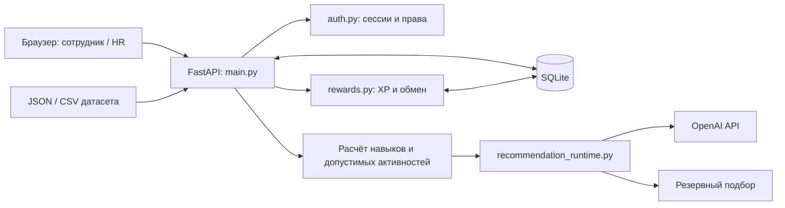

# Career Quest

**AI-навигатор карьерного развития сотрудников с персональными рекомендациями, HR-аналитикой и демонстрационными наградами.**

Хакатонный MVP для кейса АО «Народный Банк Казахстана». Сотруднику приложение помогает понять, каких компетенций не хватает до следующего грейда и какую активность выбрать сейчас. HR получает срез дефицитов навыков и видит, кому может понадобиться поддержка в развитии.

Интерфейс доступен на **русском, казахском и английском**. Проект использует синтетический датасет; дата расчёта — **1 октября 2026 года**, а не текущая дата компьютера.

## Что реализовано

### Для сотрудника

- Личный профиль: роль, грейд, навыки, карьерная цель и завершённые активности.
- Траектория к следующему грейду: требования, разрывы и критичные компетенции. Для Lead отображается развитие на текущем уровне.
- До трёх персональных рекомендаций с несколькими основаниями, доступностью мероприятия и прогнозом изменения навыков.
- Действие «Выполнить»: сохранение завершения, пересчёт навыков и обновление рекомендаций.
- Выбор языка; по умолчанию используется `preferred_language` сотрудника.
- Quest XP: личный баланс, цель накопления, обмен на демонстрационные промокоды и история обменов.

### Для HR

- Дефициты навыков с фильтрами по роли и грейду.
- Сотрудники с повторными пропусками, отказами или незавершениями за последние 183 дня среза.
- Сотрудники без доступного следующего шага и причины отсутствия рекомендаций.
- Участие в мероприятиях: записи участия, уникальные сотрудники и статусы, включая обязательные мероприятия.
- Просмотр профилей, импорт дополнительных сотрудников и истории без изменения кода.
- Подключение и отключение OpenAI через интерфейс.

Роль и сотрудник закреплены за **серверной сессией**. Сотрудник видит только свой профиль и кошелёк; HR может просматривать профили, но не выполнять активности или тратить XP от имени сотрудника. Публичных рейтингов и свободного переключения роли нет.

## Как работает решение

1. **Данные.** Сервер загружает сотрудников, навыки, требования к грейдам, мероприятия и историю. Дополнительные профили и историю HR загружает через интерфейс.
2. **Прогресс.** За основу берутся навыки на `last_review_date`. Прирост добавляется за завершения строго после этой даты и не позднее даты среза, согласно `gain` и `max_level`. Отсутствующий навык равен нулю.
3. **Допуск.** Проверяются роль, грейд, предпосылки, доступные сессии и полезный прирост. Обязательные и уже завершённые мероприятия исключаются; исключение для повторного участия — `EV_036`.
4. **Выбор.** OpenAI получает характеристики профиля, цель, разрывы, историю и допустимые активности, затем выбирает до трёх шагов и основания выбора.
5. **Проверка ответа.** Сервер проверяет структурированный ответ и формирует локализованные объяснения из подтверждённых фактов. При ошибке, таймауте или отсутствии ключа используется обозначенный в UI резервный подбор.
6. **Результат.** Сотрудник выполняет активность; завершение сохраняется в SQLite, прогресс и рекомендации пересчитываются. Изменения доступны в HR-срезе.

Повторные пропуски похожих мероприятий влияют на выбор, но не запрещают добровольную рекомендацию автоматически. Если допустимых активностей нет, приложение объясняет отсутствие следующего шага.

В истории завершённых активностей колонка **«Учёт в прогрессе»** поясняет расчёт:

- **«Учтено в исходной оценке»** — активность завершена до или в дату последней оценки; её прирост повторно не добавляется к исходным уровням навыков.
- **«Прирост после оценки»** — активность завершена после последней оценки и учитывается при пересчёте по `gain` и `max_level`. Если навык уже достиг ограничения активности, дополнительного роста может не быть.

### Роль ИИ

Основной провайдер — **OpenAI**, модель по умолчанию — **`gpt-4o-mini`**. Используется Chat Completions API со строгой JSON Schema, построенной по допустимым мероприятиям.

Модель выбирает мероприятие и категории оснований: разрыв или карьерная цель, соответствие активности профилю, история похожих событий, критичность навыка при наличии. Приложение проверяет основания и строит текст по фактам: произвольный текст модели не выдаётся за подтверждённую историю сотрудника. Имена и идентификаторы сотрудников в AI-запрос не включаются.

Резервный алгоритм учитывает критичные разрывы, полезный прирост, цель и историю. Источник рекомендации отображается в UI. Предусмотрены кеширование, объединение одинаковых запросов, ограничения частоты и времени ожидания провайдера.

### Quest XP и награды

За завершённое добровольное мероприятие начисляется **100 XP**, включая подходящие записи из истории. Обычное мероприятие награждается один раз, `EV_036` — не чаще одного раза за календарный месяц датасета. Обязательные мероприятия XP не дают.

В каталоге шесть демо-наград: Halyk Market, спортзал/бассейн, кино, кофе, электронная книга/аудиокнига и творческая активность/скалодром. Можно выбрать цель накопления и подтвердить обмен при достаточном балансе.

**Коды имеют префикс `DEMO-NOT-VALID-` и не действуют.** Партнёрских интеграций нет. XP отделён от навыков: обмен не уменьшает карьерный прогресс и не меняет рекомендации. Списание выполняется транзакционно с защитой от повторной обработки запроса.

## Технологии

| Компонент | Реализация |
|---|---|
| Backend | Python, FastAPI `0.115.12`, Pydantic через FastAPI |
| HTTP-сервер | Uvicorn `0.34.2` |
| Загрузка файлов | `python-multipart 0.0.20` |
| Хранение | SQLite, стандартный модуль `sqlite3` |
| Frontend | HTML, CSS, JavaScript без frontend-фреймворка и сборщика |
| AI | OpenAI Chat Completions, `gpt-4o-mini`, JSON Schema; HTTP через `urllib.request` |
| Авторизация | Локальные аккаунты, scrypt-хеши паролей, серверные сессии, CSRF-защита |
| Проверки | Python `unittest`, JavaScript harness на Node.js |
| Шрифты | DM Sans и Manrope через Google Fonts, запасные системные шрифты |

Node.js нужен только для отдельной проверки JavaScript; для запуска приложения он не требуется.

## Архитектура



| Файл или каталог | Назначение |
|---|---|
| `main.py` | API, загрузка данных, прогресс, рекомендации, импорт, HR-агрегаты |
| `auth.py` | Аккаунты, пароли, серверные сессии и права |
| `history_validation.py` | Проверка импортируемой истории |
| `recommendation_runtime.py` | Кеш, таймауты, ограничения и выполнение AI-запросов |
| `request_guard.py` | Ограничение размера входящих запросов |
| `rewards.py` | Начисление XP, каталог наград и обмен |
| `static/` | Интерфейс, стили, локализация и клиентская логика |
| `data/` | Стартовый синтетический набор |
| `scripts/` | Запуск, создание аккаунтов и проверка OpenAI |
| `tests/` | Автоматические проверки и контрольные профили |

Основные API: `/api/profile/{employee_id}`, `/api/recommendations/{employee_id}`, `/api/complete`, `/api/import`, `/api/hr`, `/api/rewards`, `/api/settings/openai`. Доступ к данным и изменениям проверяется сервером.

## Установка и запуск

### Требования

- Windows и PowerShell для готового `run.ps1`.
- Python **3.10+**, доступный командой `python`; сохранённые проверки выполнены на Python 3.12 в Windows.
- Полная копия проекта с каталогом `data/`.
- Интернет для первой установки зависимостей. Для AI — действующий OpenAI API-ключ и доступ к API; без ключа работает резервный подбор.

### Быстрый запуск одной командой

Откройте PowerShell **в корне проекта**. Рекомендуемая команда для жюри:

```powershell
powershell -NoProfile -ExecutionPolicy Bypass -File .\run.ps1
```

Она разрешает выполнение скрипта только в запускаемом процессе PowerShell и не меняет системную политику выполнения. Это предотвращает ошибку «выполнение сценариев отключено в этой системе» (`PSSecurityException` / `UnauthorizedAccess`) при обычных локальных настройках Windows.

Скрипт создаёт `.venv`, устанавливает зависимости и запускает приложение. При первом запуске задайте и подтвердите пароли длиной 12–256 символов:

| Логин | Доступ |
|---|---|
| `employee` | Сотрудник `E0001` по умолчанию |
| `hr` | HR-аналитика, импорт и настройки OpenAI |

Ввод скрыт. Готовых паролей в репозитории нет; при последующих запусках используются существующие аккаунты.

Откройте **http://127.0.0.1:8000/**. Остановка — `Ctrl+C` в терминале.

Если выполнение скриптов уже разрешено, доступна короткая команда:

```powershell
.\run.ps1
```

Другой порт:

```powershell
powershell -NoProfile -ExecutionPolicy Bypass -File .\run.ps1 -Port 8766
```

В этом случае откройте **http://127.0.0.1:8766/**.

Если зависимости уже установлены, можно запустить напрямую через Python, без PowerShell-скрипта:

```powershell
.\.venv\Scripts\python.exe scripts\start.py
```

### OpenAI и окружение

Войдите как HR и введите ключ в настройках OpenAI на сайте. Ключ хранится только в окружении процесса сервера, не записывается в SQLite или браузерное хранилище. После перезапуска ключ, введённый через UI, нужно ввести заново. Наличие ключа ещё не подтверждает успешный вызов API — проверьте источник полученных рекомендаций.

Альтернатива — задать переменные окружения перед запуском:

| Переменная | Назначение | По умолчанию |
|---|---|---|
| `OPENAI_API_KEY` | Ключ OpenAI; необязателен для резервного подбора | Не задан |
| `OPENAI_MODEL` | Модель с поддержкой используемой строгой схемы ответа | `gpt-4o-mini` |
| `CAREER_QUEST_DB` | Путь к SQLite | `career_quest.sqlite3` в корне проекта |
| `DEMO_EMPLOYEE_ID` | Сотрудник первого аккаунта `employee`, только при первичном создании аккаунтов | `E0001` |

[`.env.example`](.env.example) — образец настроек. **Файлы `.env` автоматически не загружаются**: одного копирования образца недостаточно. Не включайте ключи, пароли и рабочую SQLite в коммиты.

## Как проверить решение жюри

Сценарий рассчитан на первый импорт контрольных профилей. Для одновременного показа сотрудника и HR используйте разные профили браузера или приватное окно: обычные вкладки делят сессию.

1. **Запустите приложение и войдите как HR.** При необходимости подключите OpenAI.
2. **Импортируйте вместе** [`tests/fixtures/employees.json`](tests/fixtures/employees.json) и [`tests/fixtures/activity_history.csv`](tests/fixtures/activity_history.csv). Откройте профили по ID из результата загрузки.
3. **Сравните контрольные случаи:**

   | Профиль | Что демонстрирует |
   |---|---|
   | `CONTROL_CRITICAL` | Минимальный навык не обязательно приоритетен: есть другой критичный разрыв и повторные пропуски похожих мероприятий |
   | `CONTROL_PREREQUISITES` | Отсутствующие навыки равны нулю; невыполненные предпосылки исключают мероприятия |
   | `CONTROL_REPEAT` | Завершённый `EV_036` разрешён для повторной рекомендации при соблюдении остальных условий |

4. **Раскройте основания рекомендации.** Сопоставьте разрыв, соответствие активности и историю с профилем. Проверьте отметку AI или резервного подбора. Порядок рекомендаций не обязан совпадать при каждом вызове модели.
5. **Создайте аккаунт сотрудника** в другом терминале из корня проекта:

   ```powershell
   .\.venv\Scripts\python.exe scripts\create_account.py --username demo-critical --role employee --employee-id CONTROL_CRITICAL
   ```

   Задайте пароль в скрытом приглашении. Если логин уже создан, используйте его: команда не заменяет существующий аккаунт.

6. **Войдите этим сотрудником и выполните доступную активность.** Проверьте изменение навыков, запись в истории, обновление рекомендаций и XP. HR не может выполнить действие за сотрудника.
7. **Проверьте награды.** Выберите цель накопления; при достаточном балансе подтвердите обмен. Должен появиться демо-код, баланс уменьшиться, а навыки сохраниться. После обновления страницы обмен остаётся в истории.
8. **Вернитесь в HR.** Проверьте дефициты, фильтры роли/грейда, участие в мероприятиях и сотрудников без доступного шага. Переключите язык интерфейса.

Это собственные синтетические примеры проекта, а не официальные профили жюри. Выполнение и обмен сохраняются: повторный показ на той же базе использует изменённую историю. Подробный сценарий: [DEMO.md](DEMO.md).

### Автоматические проверки

После установки зависимостей, из корня проекта:

```powershell
.\.venv\Scripts\python.exe -m unittest discover -s tests -v
```

Проверка интерфейса наград при установленном Node.js:

```powershell
node tests/test_rewards_ui.cjs
```

Проверка **реального OpenAI** на трёх контрольных профилях:

```powershell
.\.venv\Scripts\python.exe scripts\check_openai.py --prompt-key
```

Ключ вводится в скрытом приглашении, если не задан в окружении. Проверка обращается к платному API и записывает результат в `openai-verification.json`; ключ из HR-интерфейса отдельному процессу проверки недоступен.

### Сохранённые результаты

В [FINAL_REVIEW.md](FINAL_REVIEW.md) зафиксирован локальный прогон: **95/95 Python-тестов**, JavaScript-проверки, проверка UI, выполнения активности и обмена награды. В [openai-verification.json](openai-verification.json) от 23 сентября 2026 года — **3/3 успешных профиля с реальным OpenAI**, время ответов 2,25 / 1,748 / 1,06 секунды.

[release-verification.json](release-verification.json) содержит отдельные замеры запуска и отклика: в проверенных локальных сценариях интерфейс укладывался в 2 секунды, рекомендации — в 10 секунд. Это результаты конкретных сохранённых прогонов, не гарантия производительности под нагрузкой или доступности внешнего API.

## Данные и интеграции

| Источник | Содержимое |
|---|---|
| `data/employees.json` | 200 синтетических сотрудников: роли, грейды, цели, навыки, язык и дата оценки |
| `data/skills.json` | 60 навыков, требования по ролям/грейдам и дата среза |
| `data/events.json` | 40 мероприятий: условия допуска, сессии и прирост навыков |
| `data/activity_history.csv` | История участия сотрудников |
| HR-импорт | Дополнительные профили JSON и история CSV в формате стартового набора |
| OpenAI API | Выбор рекомендаций и оснований из допустимых вариантов |
| Google Fonts | Загрузка шрифтов интерфейса |

Импорт проверяет идентификаторы, связи и содержимое записей. При ошибках возвращает список проблемных записей и не применяет загрузку частично. Каталог мероприятий и требований задаётся стартовыми файлами; отдельного редактора каталога нет.

Использование синтетического набора и его публикация должны соответствовать условиям хакатона; наличие файлов в проекте не означает разрешения на их открытое распространение. Интеграций с банковскими системами, LMS и партнёрами наград в текущей версии нет.

## Ограничения

- **Локальный MVP:** один процесс приложения и SQLite. Корпоративного SSO, производственного развёртывания и поддержки нескольких серверных процессов нет.
- **Фиксированная дата среза:** `2026-10-01`. Новое завершение записывается на эту дату. Если `last_review_date` совпадает с ней, выполнение блокируется, чтобы не начислять прирост внутри уже учтённой оценки.
- **Самостоятельное подтверждение выполнения:** сотрудник нажимает «Выполнить»; проверки результата наставником или внешней LMS нет. Импортируемая история считается доверенным источником после валидации.
- **Зависимость AI от API и каталога:** одинаковый ответ не гарантирован; ошибки приводят к резервному подбору. При отсутствии допустимых кандидатов рекомендации не создаются.
- **Демонстрационные награды:** нет действующих купонов, партнёрских API и денежных операций. Отдельного движка многоэтапных квестов нет.
- **Исторические ограничения:** набор не содержит полных снимков навыков, ролей и грейдов на каждую прежнюю дату. HR-разрезы используют текущие профили; траектория не является решением о кадровом повышении.
- **Границы проверки:** нагрузочные испытания, полная матрица ОС/браузеров и неизвестные официальные профили жюри не проверены. Список для HR — сигнал для диалога, а не прогноз увольнения.

Механизмы защиты описаны в [SECURITY.md](SECURITY.md); сверка с требованиями — в [FINAL_REVIEW.md](FINAL_REVIEW.md).

## Демо и материалы

**Публичная deployed-версия в репозитории не указана.** Локальный адрес после запуска: [http://127.0.0.1:8000/](http://127.0.0.1:8000/).

- [Сценарий демонстрации](DEMO.md)
- [Финальная сверка с ТЗ](FINAL_REVIEW.md)
- [Безопасность](SECURITY.md)
- [Отчёт проверки OpenAI](openai-verification.json)
- [Отчёт запуска и производительности](release-verification.json)
